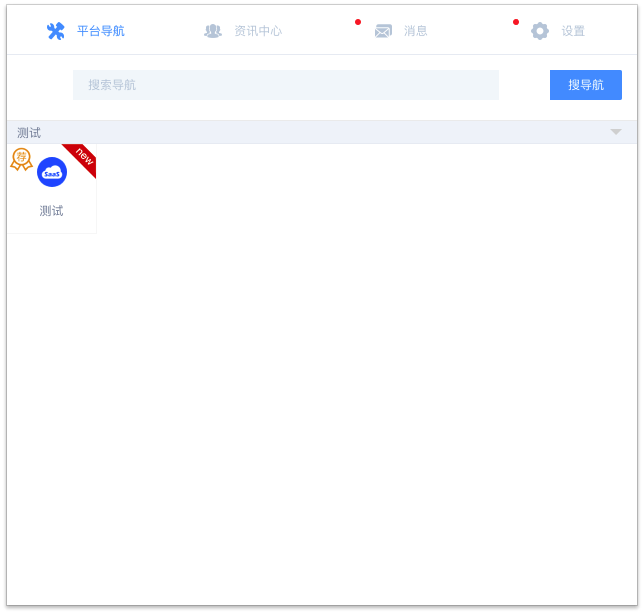
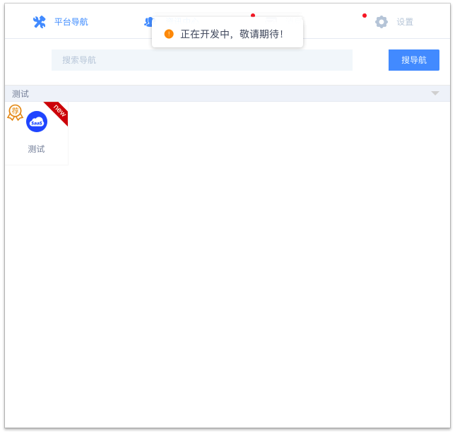

# iView Chrome Extension

本脚手架集成目前比较流行的 iView，一套高质量的 UI 组件库。

#配置信息
软件运行配置说明请看 [config.js](config.js)

**安装依赖：**

```bat
npm install
```

**以 dev 方式运行：**

```bat
npm run dev
```

**以本地方式运行：**

```bat
npm run local:dev
```

**打包成可执行文件：**

```bat
npm run build
```

#Demo




## 免责申明

**本软件是免费软件，不收一分钱，只是分享给朋友们使用，不负责售后服务。使用/更新前务必备份用户数据，软件造成任何数据丢失，本人概不负责。**
